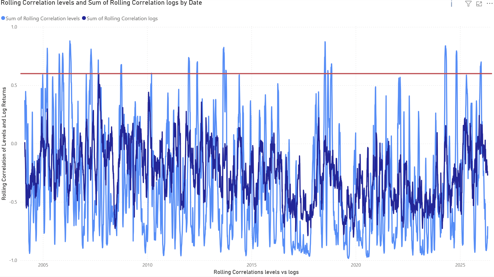
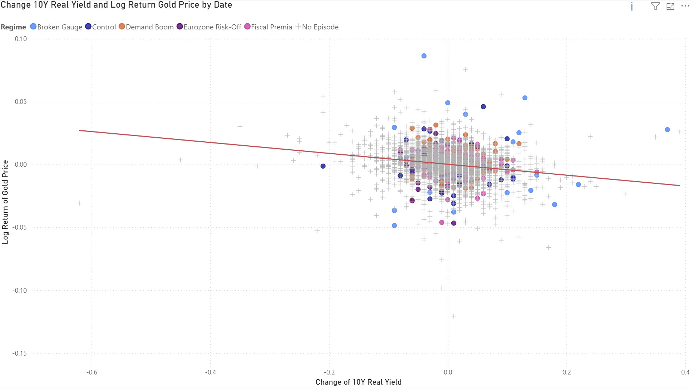
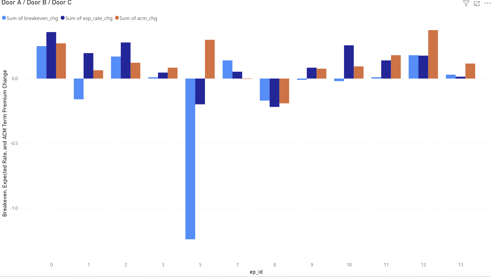
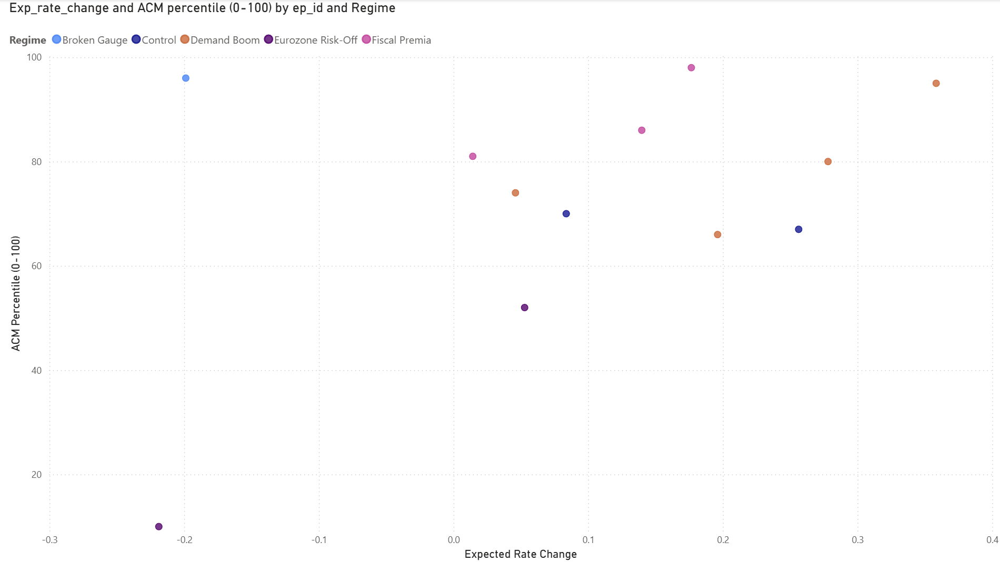
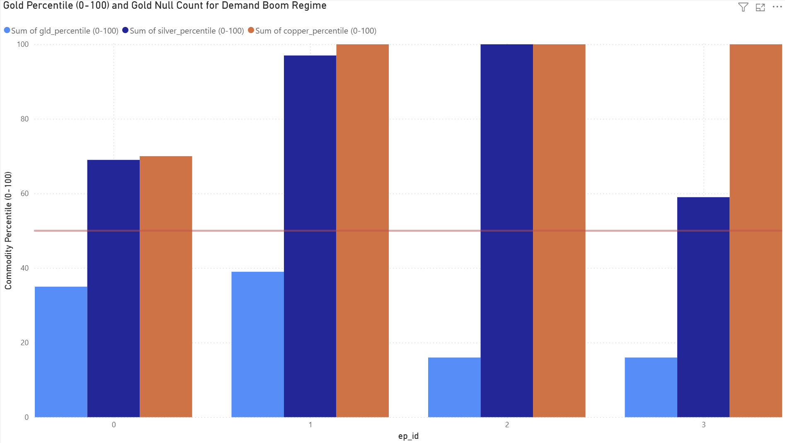

# Gold and the 10Y Real Yield

Gold pays no interest. So when real yields rise, holding gold costs you more, and gold should fall. In daily data that's exactly what happens — across 5,304 trading days from 2004 to 2026, the 30-day correlation between daily gold returns and daily changes in the 10-year TIPS yield never once turns positive.

But look at the *levels* instead of the changes and the picture breaks. On 191 days, about 3.6% of the sample, the 30-day correlation between the gold price and the real yield exceeds +0.60. Gold and its own opportunity cost, apparently moving together.

This project works out what's going on those days.

The short answer: nothing connects gold to real yields positively. On those days something else has hold of both series at once, and decomposing the yield move tells you what.

## The idea

Two bond-market identities do most of the work here:

```
Nominal 10Y = expected Fed path + term premium
Real 10Y    = nominal − breakeven inflation

⇒  real yield = expected rates + term premium − breakeven
```

So "real yields rose" is three different stories wearing the same headline. Expected rates could have risen, meaning cash genuinely pays more and gold's opportunity cost really did increase. Or the term premium rose, meaning investors demanded more compensation for duration risk — cash pays no more, and the usual causes, deficits and inflation uncertainty, are reasons people buy gold. Or breakevens fell, which pushes the real yield up arithmetically and signals a deflation scare.

Gold only cares about the first one. The textbook rule isn't really "real yields up, gold down" — it's "*expected rates* up, gold down." When the other two components do the moving, the rule's premise is simply absent.

## What I did

I flagged every stretch of consecutive days where the level correlation broke +0.60, requiring at least a trading week and 60 days of separation between episodes. That gives 12 episodes. Each one gets measured over a window starting 30 days before its first flagged day, because the rolling correlation looks backward and the measurement has to match the window the statistic actually describes.

Then each episode's yield move gets split into its three components, using the New York Fed's ACM estimate for the term premium.

For testing whether anything about an episode was *unusual*, I used the same tool throughout: take the episode's length in trading days, compute every change of that length across a matched comparison pool, throw out any window overlapping an episode, and see where the episode itself falls in that distribution. Percentiles rather than p-values, because those windows overlap heavily and the effective sample size is much smaller than it looks.

## What came out

**The two timescales are genuinely different structures.**



The light line (levels) crosses +0.60 repeatedly. The dark line (daily changes) never gets close.



The daily scatter is one negative cloud, and episode days sit inside it alongside everything else. Whatever causes the positive level correlation isn't a change in how gold responds to yields day to day.

**Every episode falls into one of five regimes.**



| Regime            | Episodes           | What actually moved                               | Gold                                                                       |
| ----------------- | ------------------ | ------------------------------------------------- | -------------------------------------------------------------------------- |
| Demand boom       | 0–3 (2005–07)    | expected rates genuinely rose                     | rose anyway, +4% to +29%                                                   |
| Broken gauge      | 5 (2008)           | breakevens collapsed 1.24pp; nominal barely moved | rose on panic — the measured real yield was distorted by TIPS illiquidity |
| Eurozone risk-off | 7–8 (2011–12)    | all three components falling together             | fell with yields                                                           |
| Control           | 9–10 (2013, 2018) | expected rates, honestly                          | **fell** — the textbook channel working                             |
| Fiscal premia     | 11–13 (2024–26)  | term premium, 56–89% of the nominal move         | rose through "rising real yields"                                          |

The 2013 and 2018 episodes matter most. Gold *fell* in both, exactly as theory says it should when expected rates are the thing moving. Having a control group is what makes the rest of this more than storytelling.

**Composition identifies a regime, not magnitude.**



Episode term-premium moves are unusual against matched windows — but not uniquely so. Episode 0 lands at the 95th percentile and episode 5 at the 96th, right alongside episode 12's 98th. Size alone doesn't distinguish the fiscal era.

What distinguishes it is a large term-premium move happening *while expected rates stay flat*. Episode 12 sits near the top with expected rates at +0.18; episode 0 sits equally high with expected rates at +0.36. Same term-premium magnitude, completely different situation.

**One 2005–07 explanation fails, another survives.**



The obvious candidate for the demand-boom era was GLD, which launched in November 2004 and opened gold to ordinary portfolios for the first time. Tested against a null of comparable windows drawn from 2005–07 only, so the fund's adoption ramp is common to both groups, episode inflows came in at the 35th, 39th, 16th and 16th percentiles. All below median, none elevated. During episode 2 — gold's largest move in the entire sample, +28.9% — GLD accumulated at 0.067 tonnes per day against 0.904 for the rest of 2006.

A second check points the same way. Annual inflows were flat, not booming: 154, 190 and 175 tonnes across 2005–07, versus 152, 353 and 152 across 2008–10. The later years absorbed just as much gold and produced no episodes at all. The "141% growth in 2005 fading to 13% by 2010" story that first drew me in turned out to be a denominator effect — the base grew from 109 tonnes to 1,129.

Copper and silver tell a different story:

| Episode | Gold   | Copper         | Silver         |
| ------- | ------ | -------------- | -------------- |
| 0       | +4.5%  | +4.8% (70th)   | +7.4% (69th)   |
| 1       | +11.8% | +28.3% (>99th) | +21.5% (97th)  |
| 2       | +28.9% | +70.1% (>99th) | +47.0% (>99th) |
| 3       | +5.8%  | +31.5% (>99th) | +4.9% (59th)   |

Episodes 1 and 2 are a broad metals surge with gold participating rather than leading. The cleanest single contrast in the whole project: during episode 2, copper sat above the 99th percentile of its era while ETF demand for gold sat at the 16th. Same window, opposite answers.

## Data

Real yields and breakevens from FRED (`DFII10`, `T10YIE`), the 10-year term premium from the New York Fed's ACM series, gold and copper and silver futures from Yahoo Finance, and GLD's daily tonnage in trust from SPDR going back to inception in November 2004.

The cleaned outputs are two files: a daily series of 5,304 trading days with episode and regime labels, and a 12-row episode table holding the decomposition and every percentile test.

## Important Considerations

The ACM term premium is a model estimate, not something you can observe. A robustness check against the Kim–Wright measure is still owed.

Everything here is reported as percentiles rather than significance tests, because the matched windows overlap heavily and a naive p-value would be badly overconfident.

The null pools aren't identical across tests — GLD uses 2005–07, the commodity tests use 2004–08.

Episodes 0 and 3 still aren't explained by either the ETF or the commodity channel. Something happened in those windows that this analysis doesn't capture.

A raw number means nothing until you know what to expect if nothing interesting were happening. Percentage growth on a growing base measures the base. Tonnes are comparable across time; dollars of copper aren't.

## Future Work

Emerging-market physical demand is the obvious gap for 2005–07. The World Gold Council's country-level data only starts in 2010, so the substitutes are Hong Kong's net gold exports to the mainland, Indian import volumes, and IMF central-bank reserve data — all monthly, which resolves one-to-three-month episodes only roughly.

The more interesting route is the futures curve. Under cost of carry, `F = S·exp((r + u − y)T)`, a high convenience yield means backwardation and genuine physical scarcity, while contango with flat inventories means the rally was financial rather than physical. That distinguishes the two stories directly, but it needs at least two contract months per date. LME and COMEX warehouse inventories, and the CFTC's commercial-versus-speculative position split, are cheaper proxies for the same question.

There's also episode 4 (August 2007, overlapping the BNP Paribas fund freeze), which the minimum-length rule dropped at four days. Worth revisiting.

## References

Adrian, Crump & Moench (2013) on the term premium. Bernanke's 2015 Brookings series is the most readable decomposition primer I found. Erb & Harvey, *The Golden Dilemma* (2013), on how unstable the gold/real-yield relationship is across eras. Barsky & Summers (1988) on Gibson's Paradox. Greenwood & Vayanos (2014) on Treasury supply and the term premium. D'Amico, Kim & Wei, *Tips from TIPS*, and Fleckenstein, Longstaff & Lustig on the TIPS–Treasury puzzle, both on why the 2008 measurement broke. Campbell, Shiller & Viceira (2009). López de Prado, *Advances in Financial Machine Learning* (2018), on label and window alignment.
